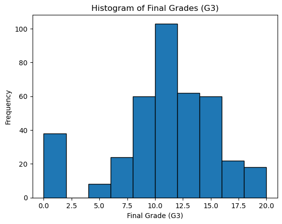
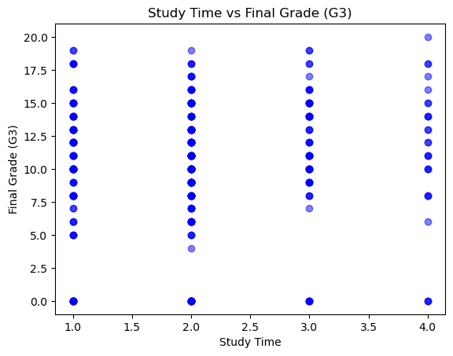
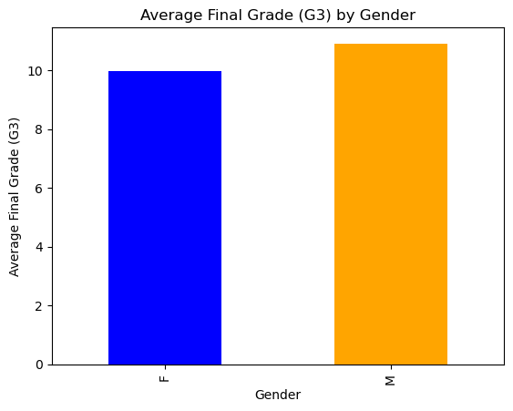

```python
# Data Loading
import pandas as pd

# Load the dataset
df = pd.read_csv(r"C:\Users\MADHU\Downloads\student\student-mat.csv", delimiter=";")  # Adjust the path and delimiter if necessary

# Display the first few rows to verify the data
print(df.head())

```

      school sex  age address famsize Pstatus  Medu  Fedu     Mjob      Fjob  ...  \
    0     GP   F   18       U     GT3       A     4     4  at_home   teacher  ...   
    1     GP   F   17       U     GT3       T     1     1  at_home     other  ...   
    2     GP   F   15       U     LE3       T     1     1  at_home     other  ...   
    3     GP   F   15       U     GT3       T     4     2   health  services  ...   
    4     GP   F   16       U     GT3       T     3     3    other     other  ...   
    
      famrel freetime  goout  Dalc  Walc health absences  G1  G2  G3  
    0      4        3      4     1     1      3        6   5   6   6  
    1      5        3      3     1     1      3        4   5   5   6  
    2      4        3      2     2     3      3       10   7   8  10  
    3      3        2      2     1     1      5        2  15  14  15  
    4      4        3      2     1     2      5        4   6  10  10  
    
    [5 rows x 33 columns]
    


```python
# Data Exploration
```


```python
# Check for missing values
missing_values = df.isnull().sum()

# Display the result
print(missing_values)
```

    school        0
    sex           0
    age           0
    address       0
    famsize       0
    Pstatus       0
    Medu          0
    Fedu          0
    Mjob          0
    Fjob          0
    reason        0
    guardian      0
    traveltime    0
    studytime     0
    failures      0
    schoolsup     0
    famsup        0
    paid          0
    activities    0
    nursery       0
    higher        0
    internet      0
    romantic      0
    famrel        0
    freetime      0
    goout         0
    Dalc          0
    Walc          0
    health        0
    absences      0
    G1            0
    G2            0
    G3            0
    dtype: int64
    


```python
# Display column data types
print(df.dtypes)

```

    school        object
    sex           object
    age            int64
    address       object
    famsize       object
    Pstatus       object
    Medu           int64
    Fedu           int64
    Mjob          object
    Fjob          object
    reason        object
    guardian      object
    traveltime     int64
    studytime      int64
    failures       int64
    schoolsup     object
    famsup        object
    paid          object
    activities    object
    nursery       object
    higher        object
    internet      object
    romantic      object
    famrel         int64
    freetime       int64
    goout          int64
    Dalc           int64
    Walc           int64
    health         int64
    absences       int64
    G1             int64
    G2             int64
    G3             int64
    dtype: object
    


```python
# Display the size of the dataset
print(df.shape)

```

    (395, 33)
    


```python
#Data Cleaning
```


```python
# Check for missing values in each column
missing_values = df.isnull().sum()
print(missing_values)

```

    school        0
    sex           0
    age           0
    address       0
    famsize       0
    Pstatus       0
    Medu          0
    Fedu          0
    Mjob          0
    Fjob          0
    reason        0
    guardian      0
    traveltime    0
    studytime     0
    failures      0
    schoolsup     0
    famsup        0
    paid          0
    activities    0
    nursery       0
    higher        0
    internet      0
    romantic      0
    famrel        0
    freetime      0
    goout         0
    Dalc          0
    Walc          0
    health        0
    absences      0
    G1            0
    G2            0
    G3            0
    dtype: int64
    


```python
# Remove rows with any missing values
df_cleaned = df.dropna()

# Display the first few rows of the cleaned data
print(df_cleaned.head())

```

      school sex  age address famsize Pstatus  Medu  Fedu     Mjob      Fjob  ...  \
    0     GP   F   18       U     GT3       A     4     4  at_home   teacher  ...   
    1     GP   F   17       U     GT3       T     1     1  at_home     other  ...   
    2     GP   F   15       U     LE3       T     1     1  at_home     other  ...   
    3     GP   F   15       U     GT3       T     4     2   health  services  ...   
    4     GP   F   16       U     GT3       T     3     3    other     other  ...   
    
      famrel freetime  goout  Dalc  Walc health absences  G1  G2  G3  
    0      4        3      4     1     1      3        6   5   6   6  
    1      5        3      3     1     1      3        4   5   5   6  
    2      4        3      2     2     3      3       10   7   8  10  
    3      3        2      2     1     1      5        2  15  14  15  
    4      4        3      2     1     2      5        4   6  10  10  
    
    [5 rows x 33 columns]
    


```python
# Remove duplicate rows
df = df.drop_duplicates()

# Verify the shape of the dataset after removing duplicates
print(f"Dataset shape after removing duplicates: {df.shape}")
```

    Dataset shape after removing duplicates: (395, 33)
    


```python
# Data Analysis Questions
```


```python
# Calculate the average score in math (G3)
average_math_score = df["G3"].mean()

# Display the average score
print(f"The average score in math (G3) is: {average_math_score}")
```

    The average score in math (G3) is: 10.415189873417722
    


```python
# Filter rows where G3 is greater than 15
students_above_15 = df[df['G3'] > 15]

# Count the number of students
num_students_above_15 = students_above_15.shape[0]

# Display the result
print(f"Number of students who scored above 15 in their final grade (G3): {num_students_above_15}")

```

    Number of students who scored above 15 in their final grade (G3): 40
    


```python
# Calculate the correlation between study time and final grade (G3)
correlation = df['studytime'].corr(df['G3'])

# Display the correlation value
print(f"The correlation between study time and final grade (G3) is: {correlation}")

```

    The correlation between study time and final grade (G3) is: 0.09781968965319639
    


```python
# Group by gender and calculate the average final grade (G3) for each gender
average_grade_by_gender = df.groupby('sex')['G3'].mean()

# Display the result
print(average_grade_by_gender)

```

    sex
    F     9.966346
    M    10.914439
    Name: G3, dtype: float64
    


```python
# Data Visualization
# Plot a histogram of final grades(G3)
```


```python
import matplotlib.pyplot as plt

# Plot a histogram of the final grades (G3)
plt.hist(df['G3'], bins=10, edgecolor='black')

# Add labels and title
plt.title('Histogram of Final Grades (G3)')
plt.xlabel('Final Grade (G3)')
plt.ylabel('Frequency')

# Display the plot
plt.show()

```


    

    


```python
#Create a scatter plot between study time (study time) and final grade (G3).
import matplotlib.pyplot as plt

# Create a scatter plot between study time and final grade (G3)
plt.scatter(df['studytime'], df['G3'], color='blue', alpha=0.5)

# Add title and labels
plt.title('Study Time vs Final Grade (G3)')
plt.xlabel('Study Time')
plt.ylabel('Final Grade (G3)')

# Display the plot
plt.show()

```


    

    


```python
# Create a bar chart comparing the average scores of male and female students.
import matplotlib.pyplot as plt

# Group by gender and calculate the average final grade (G3)
average_grade_by_gender = df.groupby('sex')['G3'].mean()

# Create a bar chart
average_grade_by_gender.plot(kind='bar', color=['blue', 'orange'])

# Add title and labels
plt.title('Average Final Grade (G3) by Gender')
plt.xlabel('Gender')
plt.ylabel('Average Final Grade (G3)')

# Display the plot
plt.show()

```


    

    


```python

```


```python

```


```python

```
